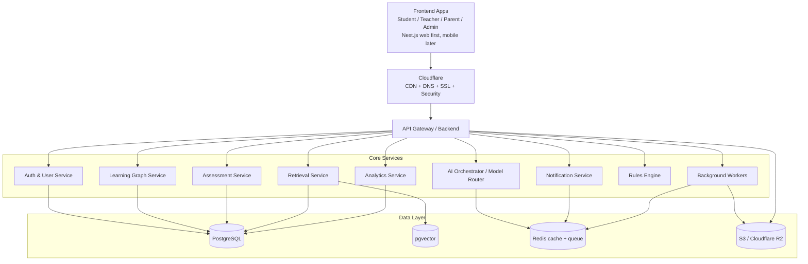
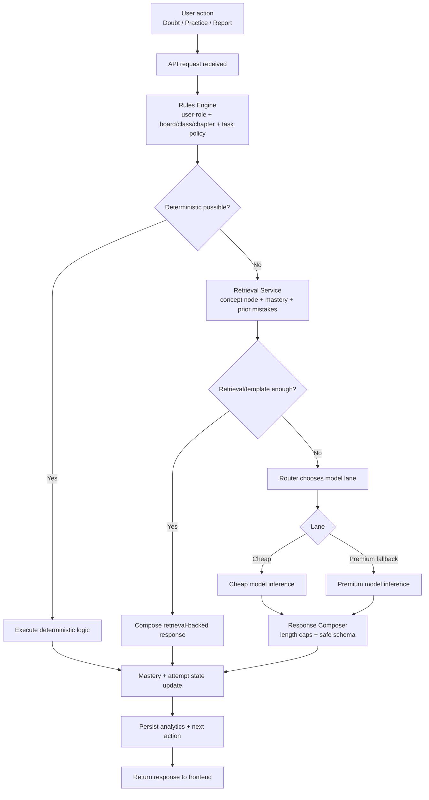

# Alfanumrik Architecture Blueprint (Cost-Disciplined Learning OS)

## 1) System diagram

## 2) Block responsibilities

- **Frontend Apps**: workflow-first UX for doubt solving, practice, reporting, and interventions (not generic chat).
- **Cloudflare**: edge security, TLS termination, caching, WAF/bot controls.
- **API Gateway/Backend**: request entrypoint, auth boundary, orchestration hub.
- **Auth & User**: users, institutions, roles, permissions.
- **Learning Graph**: concept DAG, dependencies, mastery state, weak-node detection.
- **Assessment**: attempt lifecycle, scoring, rubric logic, question performance.
- **Retrieval**: fetch minimal relevant concept/rubric/example slices.
- **AI Orchestrator**: chooses no/cheap/premium lane and enforces token budgets.
- **Analytics**: cohort and institution KPIs.
- **Notification**: reminders and intervention nudges.
- **Rules Engine**: deterministic gate to prevent unnecessary LLM calls.
- **Workers**: nightly/offline generation and heavy background tasks.

## 3) Execution policy (hard rule)

Every request follows this order:

1. **Can deterministic code solve it?**
2. **Can retrieval + templates solve it?**
3. **Can cheap model solve it?**
4. **Use premium model only as fallback.**

## 4) Three execution lanes

- **No-model lane**: scoring, mastery %, threshold recommendations, scheduling, dashboards.
- **Cheap-model lane**: translation, summarization, MCQ drafts, short explanations, tagging.
- **Premium lane**: hard reasoning, deep tutoring, content QA, complex doubt adjudication.

## 5) Learning request flow diagram (next critical operational diagram)

## 6) Cost controls to enforce in code

- Context minimization: send only concept node + student state + active task.
- Prompt caching for stable system blocks and rubric templates.
- Strict response schemas and output caps per task.
- Nightly batch generation for reusable assets (reports, hints, summaries).
- Route telemetry: track premium-lane percentage and set alert thresholds.

## 7) Reference docs

- Service ownership and responsibilities: `architecture/service-breakdown.md`
- Database ownership and schema design: `architecture/database-schema-breakdown.md`
- Retrieval design and context-packet contract: `architecture/retrieval-architecture.md`
- Mastery update formulas and scheduling policy: `architecture/mastery-update-engine.md`
- Executable SQL schema for retrieval+graph+learner state: `architecture/retrieval-learning-graph-learner-schema.sql`
